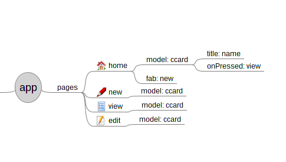

## Pages

### Sample

### Description
  Create pages for Flutter app. Specify the page name as branches to pages.
  The pages will be created under lib/pages/ folder. Page can have icon to specify its format as follow:

   specify home page, require `model:` branch to display list of that model

   specify new page, require `model:` branch

   specify view page, require `model:` branch

   specify edit page, require `model:` branch

If the branch has no symbol then the blank page from template/ will be generated