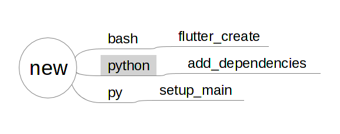

## New

The brain will start when you run
```
korapp new <app name>
```

  - First it will run `flutter create <app name>` command.
  - then it will add additional dependencies to `pubspec.yaml`.
  - then it will copy main.dart, home.dart, and theme.dart from the template and customize.



All the script files are under script/ directory.
